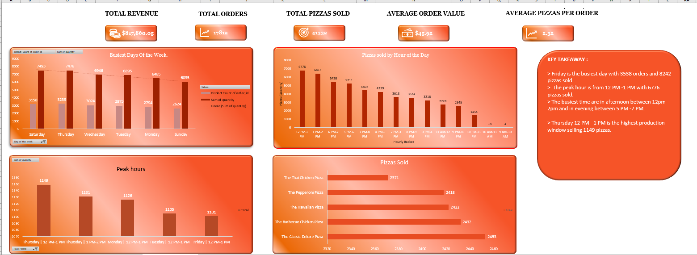
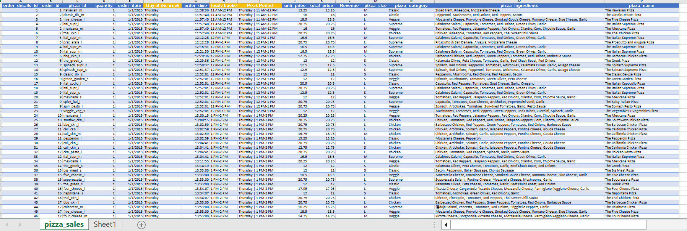

# 🍕 Pizza Sales Analysis Dashboard

> **Excel Data Analytics Portfolio Project** — turning transactional pizza sales data into business-ready insights on demand, production peaks, product performance, and order value.

[](https://www.microsoft.com/microsoft-365/excel)
[](#project-overview)

---

## 📊 Project Overview

This project analyzes pizza sales transactions in **Microsoft Excel** to answer practical business questions around:

- **Peak sales days and hours**
- **Pizza production during peak periods**
- **Best- and worst-selling pizzas**
- **Average Order Value (AOV)**
- **Seating-capacity interpretation and data limitations**

The workbook combines a raw-data table with a presentation-ready dashboard built using **PivotTables, PivotCharts, derived time fields, KPI calculations, and conditional formatting**.

### 🎯 Business Objective

The goal is to convert raw transactional data into clear answers that could support:

- Kitchen and front-of-house staffing
- Ingredient and inventory planning
- Peak-period preparation
- Menu and promotion decisions
- Revenue and upselling strategy
- Capacity planning

---

## 👀 Dashboard Preview



### Raw Data Preview



> [!NOTE]
> The images above are static previews. Download the Excel workbook for the full PivotTable and dashboard experience.

---

## 📁 Repository Files

| File | Path | Purpose |
|:---|:---|:---|
| 📗 Excel workbook | [`Data Model - Pizza Sales(2).xlsx`](Data%20Model%20-%20Pizza%20Sales(2).xlsx) | Complete Excel analysis, raw data, PivotTables, and dashboard |
| 🖼️ Dashboard preview | [`sales-dashboard.png`](sales-dashboard.png) | Screenshot of the completed dashboard |
| 🖼️ Raw data preview | [`raw-dataset.png`](raw-dataset.png) | Screenshot of the source-data structure |

> [!TIP]
> The Excel workbook is the primary project file. The PNG files are included so recruiters can preview the work directly from GitHub.

---

## 🗂️ Workbook Structure

The uploaded workbook contains two worksheets:

### `pizza_sales`

The source transaction table contains fields such as:

- `order_details_id`
- `order_id`
- `pizza_id`
- `quantity`
- `order_date`
- `Day of the week`
- `order_time`
- `Hourly bucket`
- `Peak Period`
- `unit_price`
- `total_price`
- `Revenue`
- `pizza_size`
- `pizza_category`
- `pizza_ingredients`
- `pizza_name`

These fields are used to derive the time-based and sales-performance analysis.

### `Sheet1`

The dashboard worksheet contains:

- Executive KPI cards
- Orders by day PivotTable
- Pizzas sold by hour PivotTable
- Hourly pizza-volume chart
- Day × Hour production heatmap
- Top 5 peak periods
- Top 5 best-selling pizzas
- Top 5 worst-selling pizzas
- Average Order Value calculation
- Business takeaway panels

---

# 📌 Executive Summary

| Metric | Result |
|:---|---:|
| **Total Revenue** | **$817,860.05** |
| **Total Orders** | **21,350** |
| **Total Pizzas Sold** | **49,574** |
| **Average Order Value** | **$38.31** |
| **Average Pizzas per Order** | **2.32** |
| **Raw Records** | **48,620** |

### KPI Definitions

**Total Revenue**

```text
Sum of total_price = $817,860.05
```

**Total Orders**

```text
Distinct Count of order_id = 21,350
```

`order_id` is counted distinctly because one customer order can contain multiple pizza-detail rows.

**Total Pizzas Sold**

```text
Sum of quantity = 49,574
```

**Average Order Value**

```text
AOV = Total Revenue / Distinct Orders

    = $817,860.05 / 21,350

    = $38.31
```

**Average Pizzas per Order**

```text
Average Pizzas per Order
= Total Pizzas Sold / Distinct Orders

= 49,574 / 21,350

= 2.32
```

---

# ⏰ 1. What Days and Times Do We Tend to Be Busiest?

## Busiest Day

**Friday** is the busiest day by both order volume and pizzas sold.

| Day | Orders | Pizzas Sold |
|:---|---:|---:|
| **Friday** | **3,538** | **8,242** |
| Saturday | 3,158 | 7,493 |
| Thursday | 3,239 | 7,478 |
| Wednesday | 3,024 | 6,946 |
| Tuesday | 2,973 | 6,895 |
| Monday | 2,794 | 6,485 |
| Sunday | 2,624 | 6,035 |

## Busiest Hour

The highest-volume hour is:

**12 PM – 1 PM → 6,776 pizzas**

The next strongest period is:

**1 PM – 2 PM → 6,413 pizzas**

Evening demand is also strong, especially:

**6 PM – 7 PM → 5,420 pizzas**

### 📌 Business takeaway

> Friday is the strongest overall day, while the main demand window is around **12 PM–2 PM**. A second meaningful demand window appears during the evening.

These patterns can be used to plan staffing, ingredient preparation, kitchen capacity, and order processing.

---

# 🍕 2. How Many Pizzas Are We Making During Peak Periods?

The dashboard uses a **Day × Hour PivotTable** with conditional formatting to show pizza volume throughout the week.

## Top 5 Peak Periods

| Rank | Day | Hour | Pizzas Sold |
|---:|:---|:---|---:|
| **1** | **Thursday** | **12 PM – 1 PM** | **1,149** |
| **2** | **Thursday** | **1 PM – 2 PM** | **1,131** |
| **3** | **Monday** | **12 PM – 1 PM** | **1,126** |
| **4** | **Tuesday** | **12 PM – 1 PM** | **1,105** |
| **5** | **Friday** | **12 PM – 1 PM** | **1,101** |

### 📌 Key insight

The single highest **Day × Hour** production period is:

> **Thursday, 12 PM–1 PM — 1,149 pizzas**

This points to the lunch period as a critical operating window, particularly on Thursday.

---

# 🏆 3. What Are Our Best and Worst-Selling Pizzas?

The ranking is based on **Sum of `quantity`**, so it measures pizza volume rather than revenue.

## Top 5 Best-Selling Pizzas

| Rank | Pizza | Pizzas Sold |
|---:|:---|---:|
| **1** | **The Classic Deluxe Pizza** | **2,453** |
| **2** | **The Barbecue Chicken Pizza** | **2,432** |
| **3** | **The Hawaiian Pizza** | **2,422** |
| **4** | **The Pepperoni Pizza** | **2,418** |
| **5** | **The Thai Chicken Pizza** | **2,371** |

## Top 5 Worst-Selling Pizzas

| Rank | Pizza | Pizzas Sold |
|---:|:---|---:|
| **1** | **The Brie Carre Pizza** | **490** |
| **2** | **The Mediterranean Pizza** | **934** |
| **3** | **The Calabrese Pizza** | **937** |
| **4** | **The Spinach Supreme Pizza** | **950** |
| **5** | **The Soppressata Pizza** | **961** |

### 📌 Business takeaway

**The Classic Deluxe Pizza** is the strongest seller by volume, while **The Brie Carre Pizza** is the weakest among the pizzas shown.

Potential actions include:

- Protecting ingredient availability for high-volume pizzas
- Featuring top sellers in promotions
- Testing bundles or offers for low-volume items
- Investigating whether weaker products need menu, pricing, or positioning changes

> [!NOTE]
> Low sales volume alone does **not** prove that a pizza is unprofitable. Margin, food cost, preparation effort, and strategic value would need to be analyzed before making menu-removal decisions.

---

# 💰 4. What Is Our Average Order Value?

## **$38.31 per order**

The dashboard calculates AOV using total revenue divided by the **distinct number of orders**.

```text
$817,860.05 ÷ 21,350 = $38.31
```

### Why this metric matters

Average Order Value can be used as a baseline for:

- Upselling
- Cross-selling
- Combo offers
- Add-on campaigns
- Minimum-order promotions
- Revenue-growth initiatives

The current AOV of **$38.31** can become a benchmark for future improvement experiments.

---

# 🪑 5. How Well Are We Utilizing Our Seating Capacity?

The business has:

- **15 tables**
- **60 seats**

However, the uploaded sales data does **not** include the operational fields required to measure true seat utilization, such as:

- Number of customers per order
- Table number
- Dine-in vs takeaway/delivery
- Seating duration
- Table turnover
- Customer arrival/departure time

Therefore:

> **Exact seating utilization cannot be calculated from this dataset.**

Order volume can be used as a **demand proxy**, but it should not be presented as actual occupied seats.

### Data that would be needed for future analysis

```text
order_id
customer_count
table_number
dining_type
check_in_time
check_out_time
```

With these fields, future analysis could measure:

- Seat utilization %
- Table utilization %
- Average dining duration
- Table turnover
- Peak occupancy
- Capacity bottlenecks

---

# 🧰 Excel Skills Demonstrated

This project demonstrates practical Excel skills aligned with Data Analyst work.

### Data Preparation

- Excel Table structure
- Derived columns
- Date and time transformation
- Day-of-week analysis
- Hourly bucketing
- Peak-period identification

### PivotTable Analysis

- Distinct Count of `order_id`
- Sum of `quantity`
- Orders by weekday
- Pizza volume by hour
- Day × Hour analysis
- Top 5 peak periods
- Top/bottom pizza rankings

### Visualization

- KPI cards
- PivotChart
- Column chart
- Conditional-formatting heatmap
- Ranked tables
- Business takeaway panels

### Analytical Thinking

- Selecting the correct metric for each question
- Separating orders from order-detail rows
- Distinguishing sales volume from revenue
- Identifying data limitations instead of making unsupported assumptions

---

# 🔄 Analysis Workflow

```text
Raw Transaction Data
        ↓
Data Preparation
        ↓
Derived Date / Time Fields
        ↓
PivotTable Analysis
        ↓
KPI Calculations
        ↓
Charts + Heatmap
        ↓
Business Insights
        ↓
Operational Recommendations
```

The key analytical distinction is:

```text
Distinct order_id → number of actual orders
Sum of quantity    → number of pizzas sold
Sum of total_price → total revenue
```

This prevents the common mistake of treating every order-detail row as a separate customer order.

---

# 💡 Key Business Insights

### 1. Friday is the strongest day

Friday records the highest overall order volume and pizza volume.

### 2. Lunch is the main demand window

12 PM–2 PM is the strongest production period overall.

### 3. Thursday lunch is the single highest peak period

Thursday from 12 PM–1 PM produces **1,149 pizzas**, the highest Day × Hour combination.

### 4. Evening demand is also significant

The period from roughly 5 PM–8 PM shows strong pizza volume.

### 5. A small group of pizzas drives high sales volume

Classic Deluxe, Barbecue Chicken, Hawaiian, Pepperoni, and Thai Chicken are the leading products by quantity sold.

### 6. Underperforming pizzas need deeper investigation

The Brie Carre Pizza has the lowest volume among the displayed products.

### 7. Seating utilization needs more data

The current dataset supports sales-demand analysis but not true occupancy measurement.

---

# 🎯 Business Recommendations

Based on the analysis, management could consider:

**Staffing**
- Increase kitchen and front-of-house readiness around lunch and evening peaks.
- Pay particular attention to Thursday and Friday demand.

**Inventory**
- Prepare high-volume ingredients before the 12 PM–2 PM peak.
- Prioritize availability of ingredients used in top-selling pizzas.

**Menu Strategy**
- Feature best-selling pizzas more prominently.
- Test targeted promotions for lower-volume items.
- Use margin and cost data before making menu-removal decisions.

**Revenue Growth**
- Use **$38.31 AOV** as a baseline for upselling and bundle experiments.
- Test add-ons or combinations designed to increase order value.

**Capacity Planning**
- Capture customer count and table-occupancy data in future to measure utilization accurately.

---

# 📂 GitHub File Paths

Keep the repository structure simple:

```text
pizza-sales-analysis/
│
├── README.md
├── Data Model - Pizza Sales(2).xlsx
├── sales-dashboard.png
└── raw-dataset.png
```

The README links in this document assume all three project files are stored in the **repository root**.

> [!WARNING]
> GitHub links can be case-sensitive. Keep the filenames exactly the same as the repository files, or update the Markdown paths after renaming them.

---

# 🚀 Future Improvements

Potential next steps:

- Monthly and quarterly sales trends
- Revenue by pizza category and size
- Profit and margin analysis
- Repeat-customer analysis
- Sales forecasting
- Interactive slicers
- Power BI version of the dashboard
- SQL-based version of the analysis
- Detailed capacity and occupancy analytics

---

# 👤 Portfolio Value

This project demonstrates more than basic Excel formatting.

It shows the ability to:

- Translate business questions into measurable KPIs
- Choose the correct aggregation method
- Distinguish orders from order-detail records
- Build PivotTable-driven analysis
- Analyze time-based demand
- Rank products by sales volume
- Communicate findings through a dashboard
- Identify data limitations
- Turn analysis into practical business recommendations

> **Good data analysis is not just about calculating numbers. It is about choosing the right metric, understanding what the data can and cannot tell us, and turning the result into a business decision.**

---

## 🔗 Project Files

- [📗 Open the Excel Workbook](Data%20Model%20-%20Pizza%20Sales(2).xlsx)
- [🖼️ View Dashboard Preview](sales-dashboard.png)
- [🖼️ View Raw Dataset Preview](raw-dataset.png)

---

## ✅ Project Checklist

- [x] Prepare the raw sales dataset
- [x] Create derived day and time fields
- [x] Build PivotTables
- [x] Calculate distinct orders
- [x] Calculate total pizzas sold
- [x] Calculate Average Order Value
- [x] Identify peak production periods
- [x] Rank best- and worst-selling pizzas
- [x] Build dashboard visualizations
- [x] Document business insights
- [x] Document data limitations
- [x] Prepare GitHub documentation
